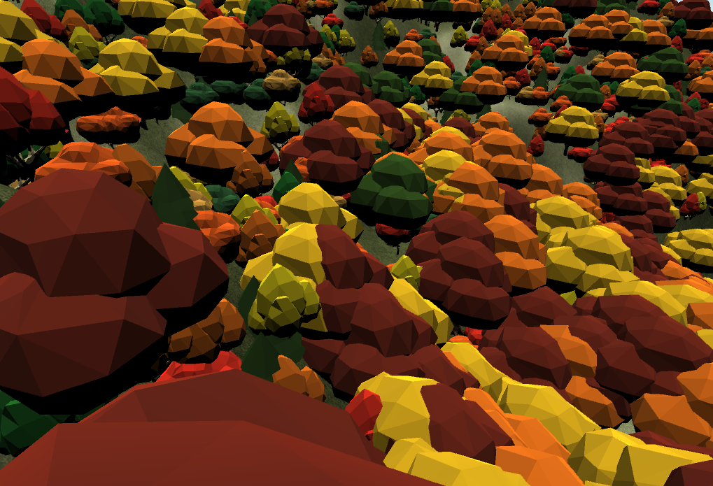
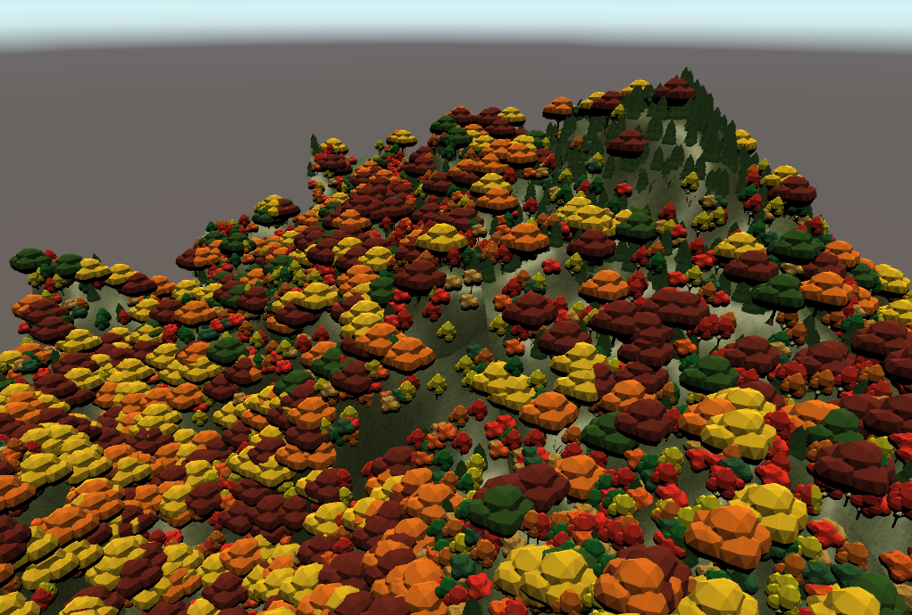
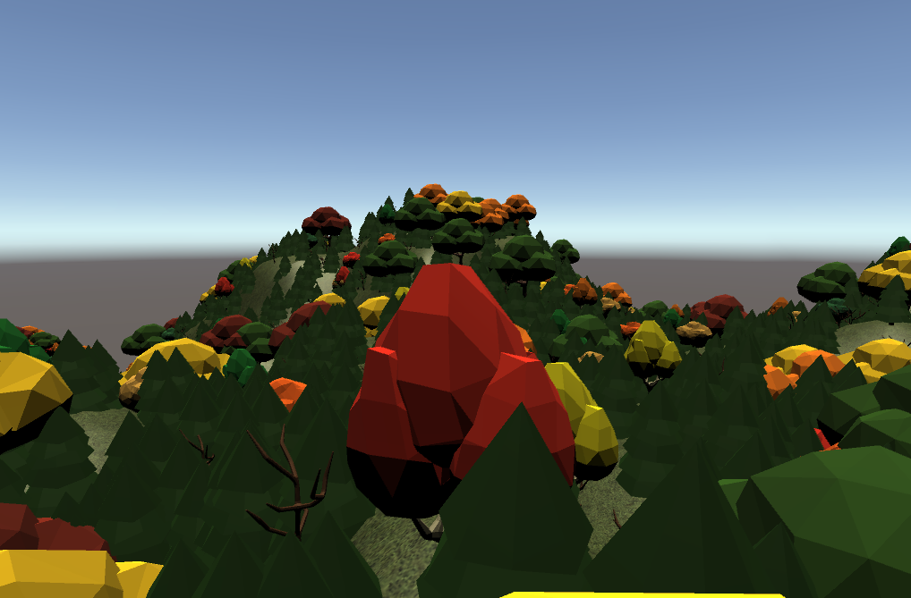
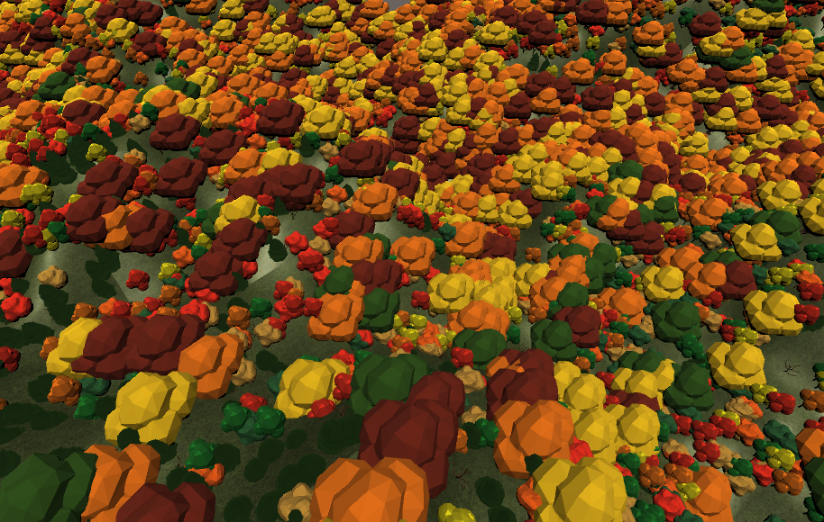

# vermont-fall-colors
A procedurally-generated world made in Unity. I generated random terrain based on tutorials from Brackeys and Sebastian Lague. It is chunk-based, with mountains and trees.

